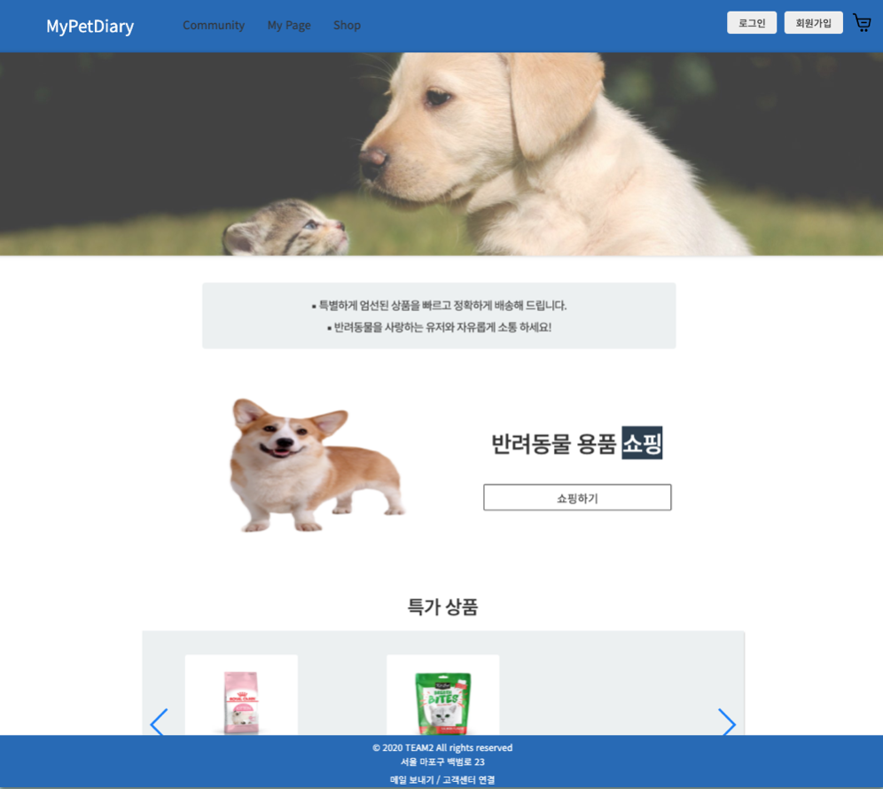
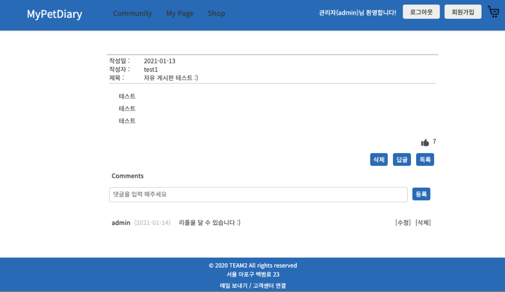
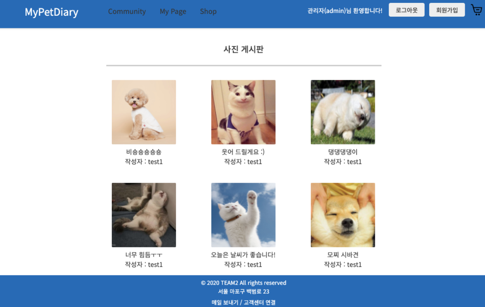
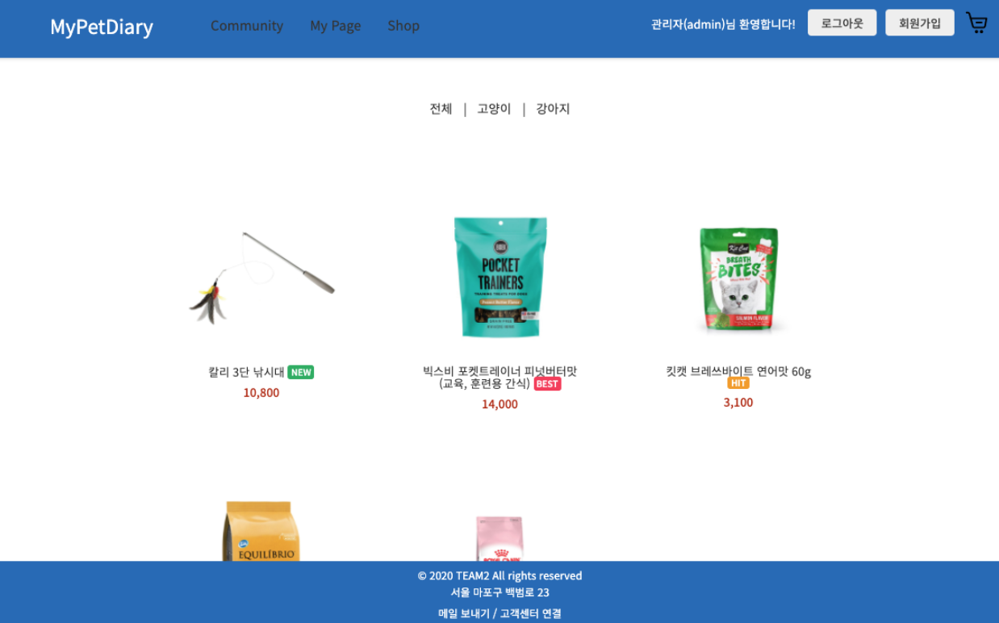
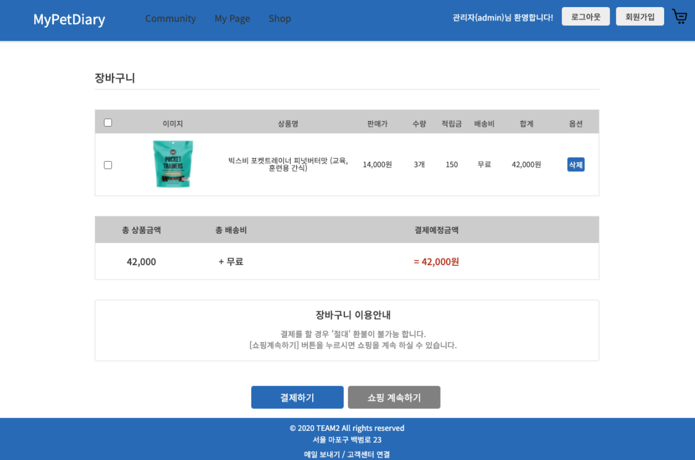

# MyPetDiary 

> 반려용품 쇼핑몰 / 종합 커뮤니티

---
### **`정보`**

1. 프로젝트 요약  
  * 많은 반려동물 관련 커뮤니티와 쇼핑몰이 있지만, 모든것을 한번에 해결할 수 있는 사이트는 없습니다.  
  커뮤니티와 쇼핑몰을 One-Stop으로 이용할 수 있는 편리한 웹사이트 제작에 초점을 맞추었습니다.

2. 사용기술 : HTML, CSS, JAVA (JSP / Servlet), JavaScript, Oracle DB      

---  
### **`구현 기능`**

1. Front-End : 웹페이지 레이아웃 설계 및 스타일링 작업 / 회원정보 및 게시물 유효성 검사 

2. Back-End (직접 구현한 기능은 볼드 처리)
  * 회원가입 / **정보수정 / 회원탈퇴**
  * 로그인 / 로그아웃
  * **관리자 메뉴 (회원 목록, 상품 관리)**
  * 자유게시판 / 사진게시판 구현 
  * **문의게시판 구현 (리스트, 상세보기, 작성, 수정, 삭제 / 리플 등록, 수정, 삭제 / Like 기능)**
  * 게시물 작성에 따른 유저 레벨업 기능
  * 상품 목록 및 상세보기
  * 장바구니 담기 및 결제 기능

---
### **`구현 화면`**

* **자유 게시판**

* **사진 게시판**

* **상품 목록**

* **장바구니** 

